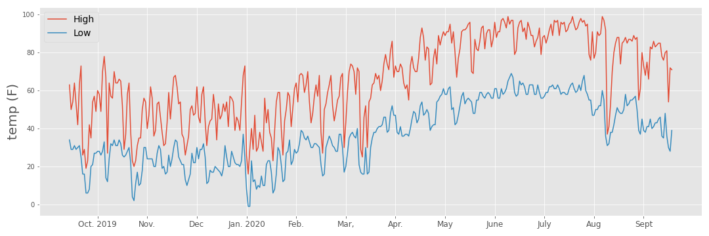
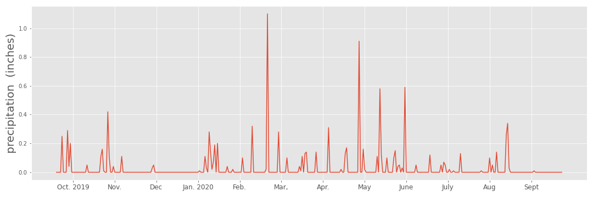
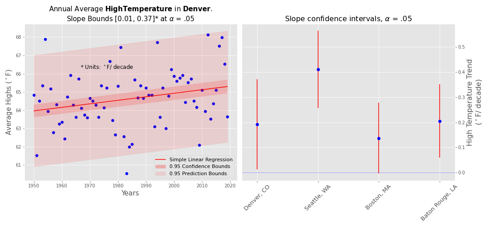
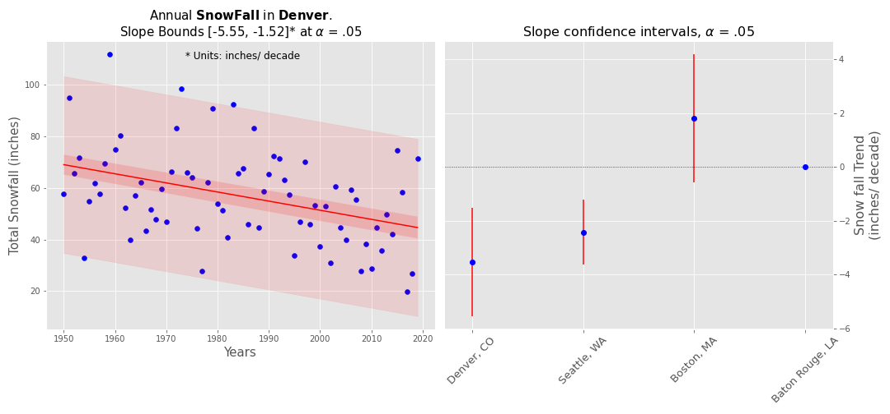
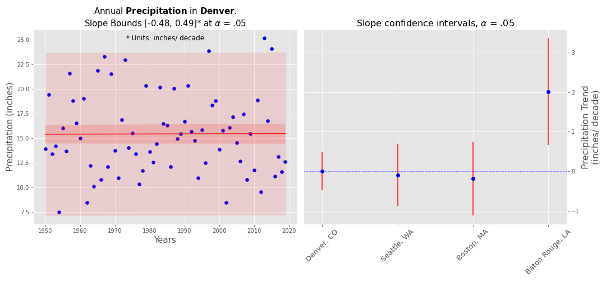
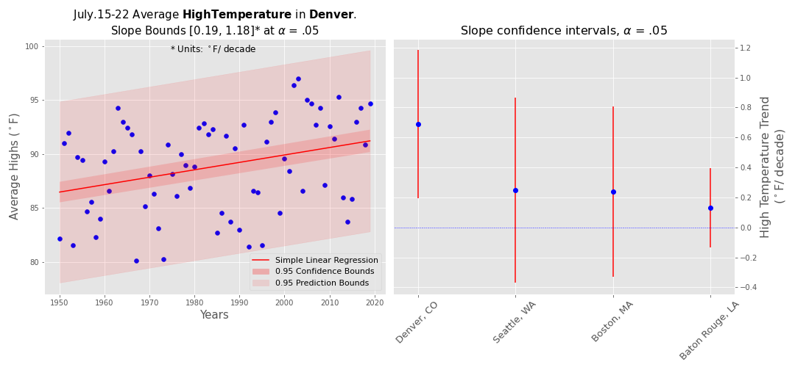
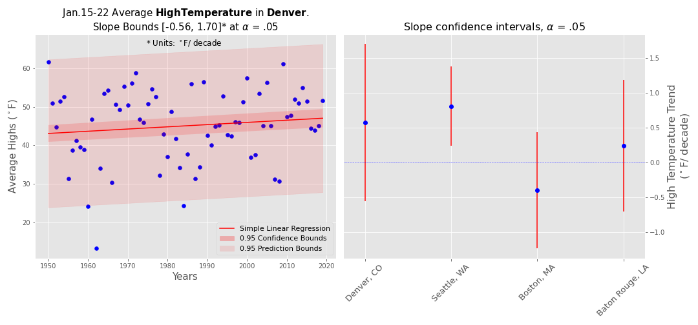

# Local Climate Trends: What is actually happening where I live?

Global warming has on average driven temperatures up by 0.32 deg F per decade since 1981 [[1]](#1).  In any particular geographic location this trend may vary widely, furthermore the effects on weather are more unpredictable with some regions seeing increased rainfall and others drought.  
Many of us have moved so often we wouldn't have witnessed a weather change where we live and memory is fallable anyhow.  So is the weather we're experiencing now very different than 30 years ago & if so how serious is the trend?  Second should we expect trends we've noticed in another city to continue in Denver?  Fortunately there are extensive public weather records to draw from and excellent statistical analyses have been developed to inform our hypotheses.

## The Dataset
The GHCN (Global Historical Climatology Network), [[2]](#2) is a databse of collected weather observations from over 100,000 weather stations across the globe.   I've collected data from 1950 to 2020 from selected stations in Denver, Seattle, Boston, and Baton Rouge. These datasets provide fairly reliable daily recordings of the high & low temperatures ```TMAX``` and ```TMIN``` in  deg F, the precipitation ```PRCP``` in inches, and new snowfall ```SNOW``` in inches.  Many records I browsed through go back to the mid 19th century, though there were often significant gaps up into the 1940's.  
Shown below is the the daily temperature range and precipitation for Denver over the last year.




## Questions
1. Are weather statistics in Denver trending significantly from historical distributions?
    - H0:  The expected value of the regression slope (for the listed weather measurements) as a function of time is zero, meaning the expected value is unchanging over time.
    - HA: The expected value of the regression slope is significantly unlikely to be zero
2. Are the trends between different locations across the United States significantly different?
    - H0:  The regression slopes in different cities are drawn from the same distribution
    - HA:  The regression slopes in different cities are significantly different
## Methods/Statistical Analyses
For each of the measured values (```TMAX```, ```SNOW```, ```PRCP```) in each city (Denver, Seattle, Boston, Baton Rouge) values are first averaged annually (or seasonally), simple linear regression is performed and the expected value and 95% two-tailed confidence interval of the slope parameter is calculated.  If Zero is not within the confidence interval then there is a statistically significant non-zero trend.  
To compare trends between cities the confidence intervals are calculated for each at alpha=0.05 with an additional Bonferroni correction of 6, since there are 6 pair-wise comparisons between 4 cities.  If the bounds between 2 cities do not overlap they have significantly different trends.  
To avoid modelling the cyclic annual behaviour weather statistics values were averaged annually, at first over the entire year and later over selected weeks or seasons.  When plotting the line of best fit the 95% confidence bounds are shaded (an estimate of the mean of the distribution) as well as the 95% probability bounds (where 95% of all samples should lie) as an aid to visualizing the sample distribution [[3]](#3)).

## Results

Trends in the daily high temperature in Denver and the confidence bounds of the slope compared to other cities.  All cities except Boston show a significant trend towards increasing temperature, analysis on the daily low temperature shows a similar trend.  The average increase in Denver is 0.19 deg F rise each decade.



Trends in the yearly snowfall in Denver and the confidence bounds of the slope compared to other cities.  Denver and Seattle have significant decrease in snowfall, with the average rate in Denver at about 3.5 inches of snow less each decade.



Trends in precipitation (rain and melted snow) for Denver with confidence intervals compared to other cities.  Only Baton Rouge has a significant trend in rainfall with an increase of ~2 inches each decade.



Below is a comparison of each of hte cities for the 3 measured values using the Bonferroni correction.  In this case noe of the trends appear to be different between cities.  


## Discussion
In Denver there is a signifacant trend towards increased temperature and decreased snowfall with an average increase of 1.14 deg F since 1950 and a decreased expected annual snowfall of 24.64"!  Trends towards increasing temperature were similar across other cities though precipitation and snowfall varied.

## Future Work
- Fit the data to an improved regession model that takes into account the cyclic annual variations of each parameter.  Perhaps this would improve the statistical power when calculating expected distributions on any given date, opposed to over yearly averages & sums.

## Additional Plots
Seasonal trends in temperature for Denver




Weather trends in a sample of Colorado towns


## References
<a id="1">[1]</a> 
[Climate Change: Global Temperature, Lindsey, R. and Dahlman L (Aug. 1, 2020)]('https://www.climate.gov/news-features/understanding-climate/climate-change-global-temperature)

<a id="2">[2]</a> 
https://www.ncdc.noaa.gov/cdo-web/

<a id="3">[3]</a> 
http://nbviewer.ipython.org/github/demotu/BMC/blob/master/notebooks/CurveFitting.ipynb

<a id="4">[4]</a> 
https://www.nature.com/scitable/knowledge/library/the-global-climate-system-74649049/


